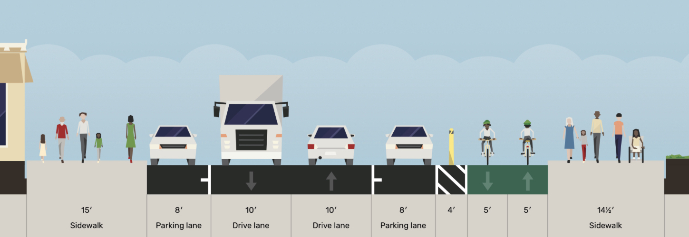

*Our vision for Safer Illinois is a high-quality, protected two-way bikeway.*

#### High quality

Two-way cycle tracks can provide a spacious, comfortable feeling for bikes, with plenty of room for passing and riding side-by-side. This design works best along coastlines or roadways that are mostly uninterrupted by driveways or major road crossings. The Terry Francois bikeway, at the north edge of our proposal for Illinois, is a great example. 

Safer Illinois would essentially continue that bikeway, turning the corner onto the east edge of Illinois and running all the way to south to Marin St. It’s a perfect place for this design as there are almost no driveways on the east side of the street and roadways that cross the bikeway have relatively low volumes of traffic. 

#### Fully protected

The bikeway would be protected by bollards and parked cars, with minimal changes to concrete and curbing. 

Parked cars would keep bikes and scooters well removed from the large trucks and cars that drive down Illinois. A 4’ buffer would protect bikes and scooters from being “doored” by passengers in the parked cars. Daylighting at intersections would give vehicle drivers a view of approaching traffic in the bikeway and the pedestrians crossing. 

#### No Downsides

Illinois is wide enough that we can fit a high-quality, fully protected bidirectional bikeway on the street with almost no parking losses, all while keeping bikes and scooters out of the way of cars and trucks.

[Daylighting](https://www.sfmta.com/getting-around/walk/daylighting) the corners to make the corridor safer for pedestrians will necessitate removing a few spaces at the intersections on both sides of the street, but these changes would have been required by California law in any case. Removal of a few more spaces may be needed to ensure delivery trucks have adequate space to access loading docks.

We have more than 35 supporters, including many local businesses whose team members bike along Illinois to get to work.

#### Current Status

Wide lanes and long stretches without stop signs or traffic lights encourage vehicles to go well over the 25 mph speed limit. Over a typical hour, 150 large trucks (cement truck or larger) travel along some portion of Illinois St. 

The painted bikes lanes, which are well within the door zone of parked cars, are regularly used as loading zones for trucks and cars or as storage for dumpsters. In some stretches, old rail tracks are still in place- these are especially hazardous when bikes have to go around double-parked vehicles. (Throw in some rain and a speeding car and you too may find yourself with 6 stitches in your lip.)



#### Draft Designs

Safer Illinois proposes a 10’ to 12’ bidirectional bikeway along the east side of Illinois, bordered by a 4’ buffer to keep users away from the door zone of parked cars. The parking configurations along either side of the street would be largely unchanged. 

The SFMTA and the SF Port have NOT weighed in on these drafts, so please see them as proof of concept rather than fait acompli. But if you wanna nerd out and dig in, have at it! You can let us know what you think at [contact@safe-illinois.org](mailto:contact@safe-illinois.org).

[Download the draft diagram here](documents/Illinois-St-Draft-Designs.pdf)

#### Islais Creek Bridge

While not included in our draft plan, improvements to the Islais Creek bridge and its approach are needed to make Illinois St. a reliably safe and low-stress bike route. Fixing the crossing would require the Port to work with SFMTA on an improved approach, especially on the east side, which has railroad track crossings, no sidewalk, and a narrow painted lane. Ideally, improvements would enable the bidirectional pathway to continue over Islais Creek by substantially widening the narrow sidewalk space on the east side of the bridge or by building a stand-alone bike and pedestrian bridge to continue the bike route. More immediately, the bridge could be improved with roadway repairs and resurfacing, potentially with separate signaling to allow safe bike crossing using the vehicle lanes. Some of these improvements could be a part of the DPW mitigation plan for [renovating the 3rd St bridge](http://sfpublicworks.org/Islais-Creek-Bridge), while the [Waterfront Resilience Program](https://sfport.com/wrp) could incorporate others.