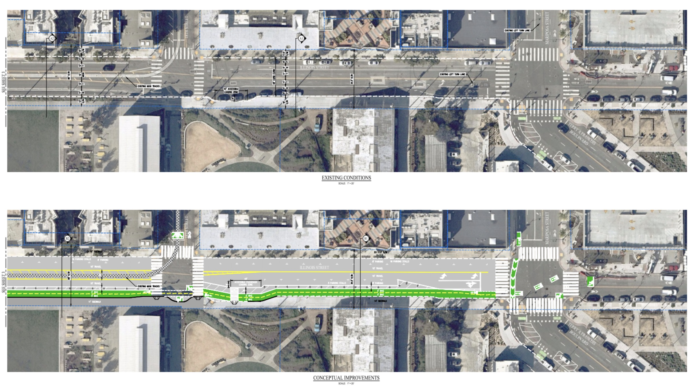

---

---

Our vision is that fully protected lanes on Illinois would connect with existing protected routes to the North and South, providing a continuous route that is accessible to all users.

High-quality infrastructure on Illinois will reduce bike injuries on 3rd St, a parallel high-injury and high-speed corridor.

The new 2-way protected bike route could be situated on the east side of the street where there are few driveways. Because the existing lanes are wide (15' in some places), narrowing them will both reduce excessive speeds and make room for the protected bikeway, with very little parking loss.

