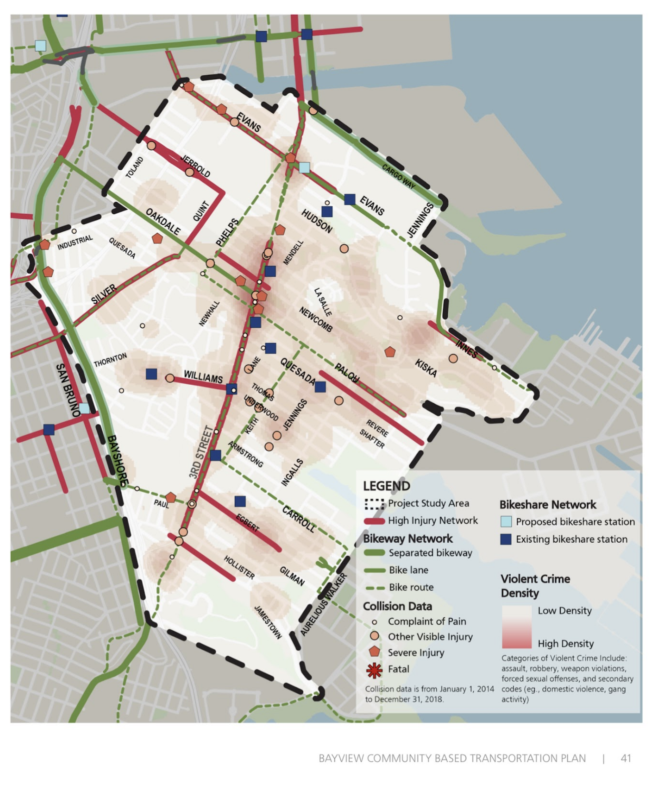

*Our plan safely connects communities and promotes healthy and green alternatives.*

#### Recreation

Safer Illinois fills a 1.1 mile gap to connect 6 miles of protected bikeway/shared space, from the India Basin Shoreline Park via the Cargo Way bike path all the way to Broadway and Embarcadero. Safer Illinois would be a huge upgrade for the Bay Trail, providing access to paddle boarding at Crane Cove Park, a concert or game at Oracle or Chase, eco-exploration at the Heron's Head Park EcoCenter, a ferry to Angel Island, or access to any other of the roughly 25 parks and recreational facilities accessible using Illinois St. 



#### Equity

Safer Illinois would provide a desperately needed safe route for Bayview-Hunters Point and other southeastern neighborhoods to get to downtown and to connect to western routes (Ceasar Chavez and 17th St), which are currently being improved. High-quality and safe bike infrastructure is lacking in the southeastern part of the city, restricting access to this low-cost, healthy, reliable and fast form of transport.

#### Safety

In addition to reducing accidents along the actual route, Safer Illinois would draw bikes and scooters off the parallel stretch of Third Street, which is part of the high-injury network. While Illinois itself might not currently be part of the high-injury network, many supporters have shared their personal horror stories of trips to the ER, stitches to severed lips, surgeries, broken bones, and gnarly bruises. Safer Illinois is clearly needed for San Francisco to achieve its commitment to Vision Zero.

#### Health & Environment

As it is widely supported and without any active opposition, Safer Illinois could be a quick win and a nice showpiece for the buildout of SFMTA’s Active Communities Plan bike network. By bridging a critical gap, Safer Illinois will get people out of their cars and onto the healthiest and cleanest mode of transport available. And, yes, we do need to pick up the pace to meet San Francisco’s Climate Action Plan, requiring that “by 2030, 80% of all trips are low-carbon (e.g. transit, walking and biking).”  
