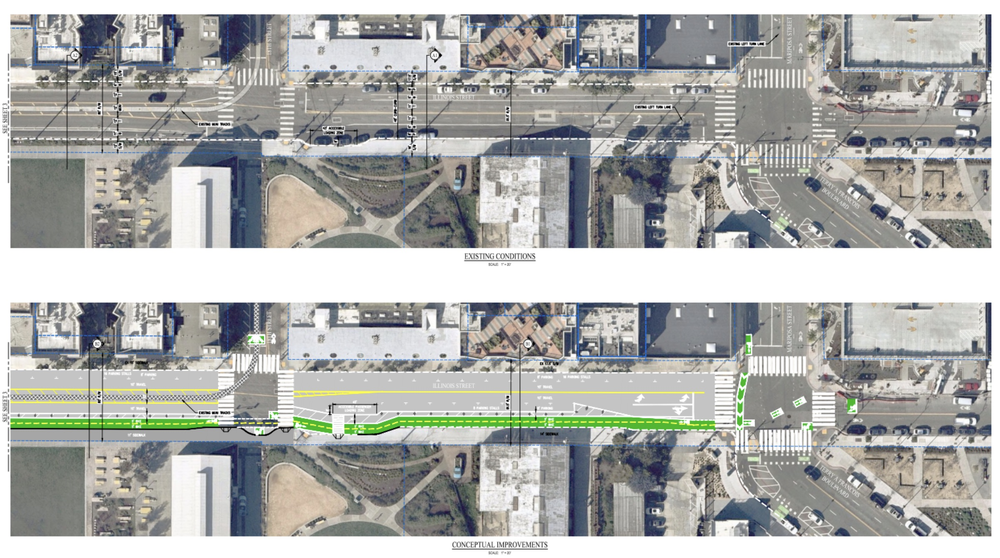

*Nuetras vision para Una Illinois Mas Segura es un routa continua, protegida, conectada, y de alta calidad para todos los usuarios.*

#### Alta calidad

Las vias de dos sentidos puede proporcionar una sensacion de comodidad y suficientes espacio para que puedan circular dos bicicletas. Este diseno funciona mejor cuando se encuentra a lo largo de la costa o carreteras por las que no cruzan otras vias principales. La ciclopista Terry Francois en el norte es un gran ejemplo de nuestra propuesta.

Una Illinois Mas Segura esencialmente continuaria esa ciclopista dando la vuelta al hacia el borde este de Illinois y recorreria todo el camino hacia el sur hasta Marin St. Es un lugar perfecto para este diseno ya que casi no hay vias automovilisticas en el lado este de el calle y las vias que cruzan la ciclopista tienen un volumen de trafico relativamente bajo.

#### Completamente protegida

La ciclopista estaria protegida por postes y vehiculos estacionados con cambios minimos al pavimento y a los limites de la calle.

Los vehiculos estacionados mantendrian a las bicicletas alejadas de los coches y camiones que circulan por Illinois. Un area de cuatro pies protegeria a las bicicletas de choques con las puertas abiertas de los vehiculos estacionados. Intersectiones con visibilidad mejorada dejarian ver a los conductores el trafico de la ciclopista.

#### Sin consecuencias negativas

La calle Illinois es suficientemente ancha pana tener una ciclopista bidirecional completamente protegida y de alta calidad casi sin perder lugares de estacionamiento.

Liberar las esquinas para tener un corredor mas seguro para los peatones requiere remover algunos espacios en las intersecciones en ambos lados de la calle. Es posible que se requiera remover algunos espacios adicionales para que los caminoes puedan usar las bahias de carga.

Hasta el momento, hemos hablado con mas de cincuenta negocios y organizaciones y ninguno se ha opuesto.

#### Estatus Actual

Tener carriles anchos y tramos largos sin senales de alto ni semaforos incentiva que los vehiculos rebasen el limite de velicidad de 25 millas por hora. Durante una hora tipica 150 camiones grandes (de cemento o mas grandes) viajan a lo largo de algun tramo de la calle Illinois.

Los carriles pintados que estan dentro de las zonas de estacionamento de los coches, normalmente son usados como zonas de carga de camiones y coches, y como areas para contenedores de basura. En algunos tramos, todavia hay viejas vias de tren que son dificiles de pasar cuando los bicicletas tienen que rodear a los vehiculos estacionados en double fila. 

#### Disenos preliminares

Una Illinois Mas Segura propone una ciclopista bidirecinoal de 10' a 12' a lo largo del lado este de la calle Illinois, con una zona de seguridad de 4' peis para mantener a los usarios lejos de las puertas de los vehiculos estacionados. La configuracion de los lugares de estacionmiento a ambos lados de la calle permaneceria practicamente intacta.

La SFMTA y el Puetro de San Francisco no han aprobado estos disenos preliminares, asi que deben verse como conceptos y no como hechos. Dejenos saber que piensa.

sensacion - needs accent on o
vias - needs accent on i
vias - need accent on i
diseno - need enne
continuaria - need accent on second i
recorreria - needs accent on i
automovilisticas - needs accent on second i
trafico - needs accent on a
vehiculos - needs accent on i
mantendrian needs accent on e
area - needs accent on first a
bahias - needs accent on i
tipica - needs accent on first i
mas - needs accent on a
estan - needs accent on a
dificiles - needs accent on second i
Disenos - needs enne on n
permaneceria - needs accent on i
Dejenos - needs accent on first e