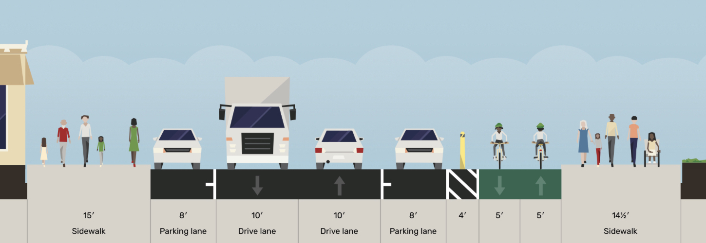

*Nuetras vision para Una Illinois Más Segura es un routa continua, protegida, conectada, y de alta calidad para todos los usuarios.*

#### Alta calidad

Las vías de dos sentidos puede proporcionar una sensación de comodidad y suficientes espacio para que puedan circular dos bicicletas. Este diseño funciona mejor cuando se encuentra a lo largo de la costa o carreteras por las que no cruzan otras vías principales. La ciclopista Terry Francois en el norte es un gran ejemplo de nuestra propuesta.

Una Illinois Más Segura esencialmente continuaría esa ciclopista dando la vuelta al hacia el borde este de Illinois y recorrería todo el camino hacia el sur hasta Marin St. Es un lugar perfecto para este diseño ya que casi no hay vías automovilísticas en el lado este de el calle y las vías que cruzan la ciclopista tienen un volumen de tráfico relativamente bajo.

#### Completamente protegida

La ciclopista estaria protegida por postes y vehículos estacionados con cambios minimos al pavimento y a los limites de la calle.

Los vehículos estacionados manténdrian a las bicicletas alejadas de los coches y camiones que circulan por Illinois. Un área de cuatro pies protegeria a las bicicletas de choques con las puertas abiertas de los vehículos estacionados. Intersectiones con visibilidad mejorada dejarian ver a los conductores el tráfico de la ciclopista.

#### Sin consecuencias negativas

La calle Illinois es suficientemente ancha pana tener una ciclopista bidirecional completamente protegida y de alta calidad casi sin perder lugares de estacionamiento.

Liberar las esquinas para tener un corredor más seguro para los peatones requiere remover algunos espacios en las intersecciones en ambos lados de la calle. Es posible que se requiera remover algunos espacios adicionales para que los caminoes puedan usar las bahías de carga.

Hasta el momento, hemos hablado con más de cincuenta negocios y organizaciones y ninguno se ha opuesto.

#### Estatus Actual

Tener carriles anchos y tramos largos sin senales de alto ni semaforos incentiva que los vehículos rebasen el limite de velicidad de 25 millas por hora. Durante una hora típica 150 camiones grandes (de cemento o más grandes) viajan a lo largo de algun tramo de la calle Illinois.

Los carriles pintados que están dentro de las zonas de estacionamento de los coches, normalmente son usados como zonas de carga de camiones y coches, y como areas para contenedores de basura. En algunos tramos, todavia hay viejas vías de tren que son difíciles de pasar cuando los bicicletas tienen que rodear a los vehículos estacionados en double fila. 



#### Diseños preliminares

Una Illinois Más Segura propone una ciclopista bidireccional de 10 a 12 pies de largo del lado este de la calle Illinois. Con una zona de seguridad de 4 pies para mantener a los ciclistas lejos de las puertas de los vehículos estacionados. La configuración de los lugares de estacionmiento en ambos lados de la calle permanecería prácticamente intacta.

La SFMTA y el Puerto de San Francisco no han aprobado estos diseños preliminares, asi que deben verse como conceptos y no como hechos. [Déjenos saber que piensa.](mailto:contact@safe-illinois.org)

[Descargar el borrador del documento](documents/Illinois-St-Draft-Designs.pdf)