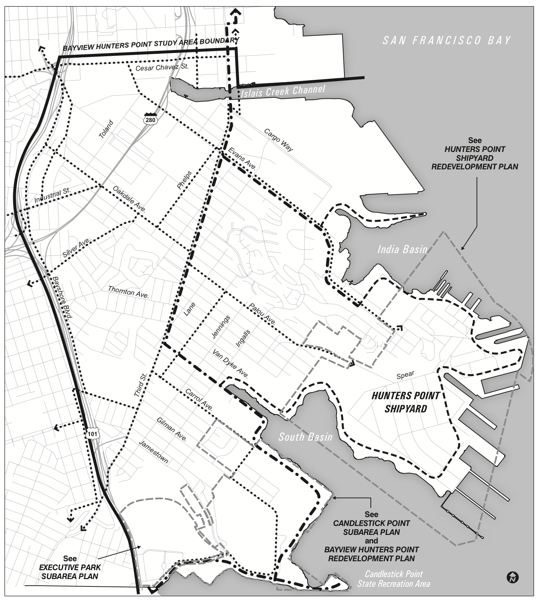

*Nuestro plan conecta comunidades de forma segura y promueve alternativas verdes y saludables.*

#### Recreación 

Safer Illinois llena una brecha de 1.1 millas para conectar 6 millas de ciclovias compartidas, desde el Parque India Basin Shoreline, a traves de la ciclovia Cargo Way, hasta Broadway y Embarcadero. Safer Illinois seria una gran mejora para el proyecto Bay Trail, proporcionando acceso para hacer paddle boarding en el parque Crane Cove, un concierto o un juego en Oracle o Chase, eco-exploracion en el Heron's Head Park EcoCenter, un ferry a Angel Island, o acceso a cualquiera de los aproximadamente 25 parques e instalaciones recreativas accesibles utilizando Illinois St.



#### Equidad

Safer Illinois proporcionaria una ruta que se necesita urgentemente para connectar Bayview-Hunters Point y otros vecindarios del sureste con el centro de la ciudad y con las rutas occidentales (Ceasar Chavez y la calle 17), que actualmente se están mejorando. Hace falta una infraestructura segura y de alta calidad para bicicletas en la parte sureste de la ciudad, lo cual restringe el acceso a esta forma de transporte rápida, confiable, saludable y de bajo costo.

#### Seguridad

Ademas de reducir los accidentes a lo largo de la ruta real, Safer Illinois atraeria bicicletas y scooters desde el tramo paralelo de la calle 3, el cual es parte de la red de alto riesgo. Si bien Illinois no es actualmente parte de la red de alto riesgo, muchos partidarios han compartido sus historias personales de terror de viajes a la sala de urgencias, puntos de sutura en labios cortados, cirugias, huesos rotos y moretones. Safer Illinois es claramente necesario para que San Francisco cumpla con su compromiso con el proyecto Vision Zero.

#### Salud y medio ambiente

Ya que actualmente muchas personas apoyan el proyecto Safer Illinois y no existe una oposición activa, éste podría representar una rapida victoria y una muestra de la red ciclista del Plan de Comunidades Activas de la SFMTA. Al llenar éste importante hueco, Safer Illinois sacará a la gente de sus coches y la llevará a la forma de transporte más limpia y saludable. Y sí, necesitamos acelerar el ritmo para complir con el Plan de Acción Climática de San Francisco, que requiere "que para 2030, 80% de los viajes sean de baja emisión de carbono (a pie, en bicicleta, o en transporte público).
